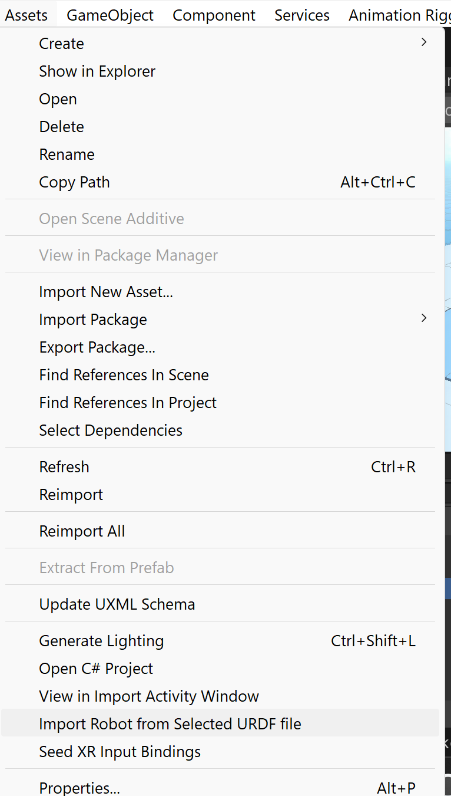
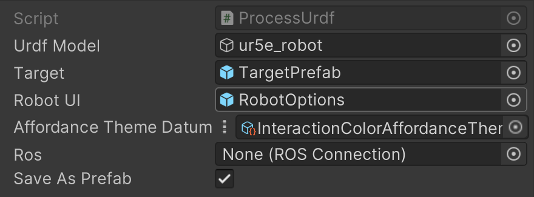
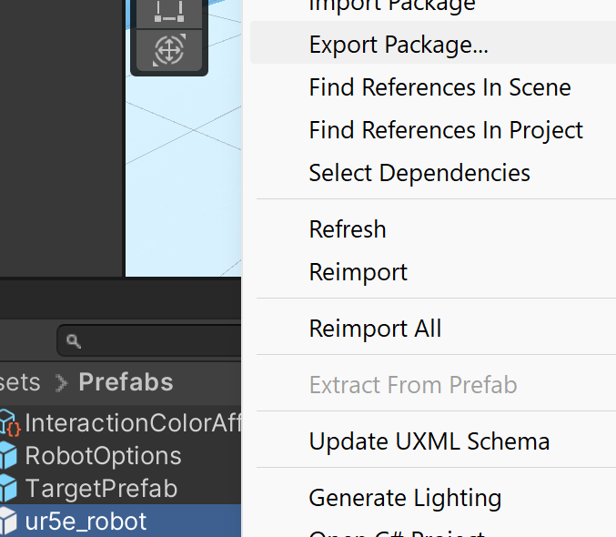
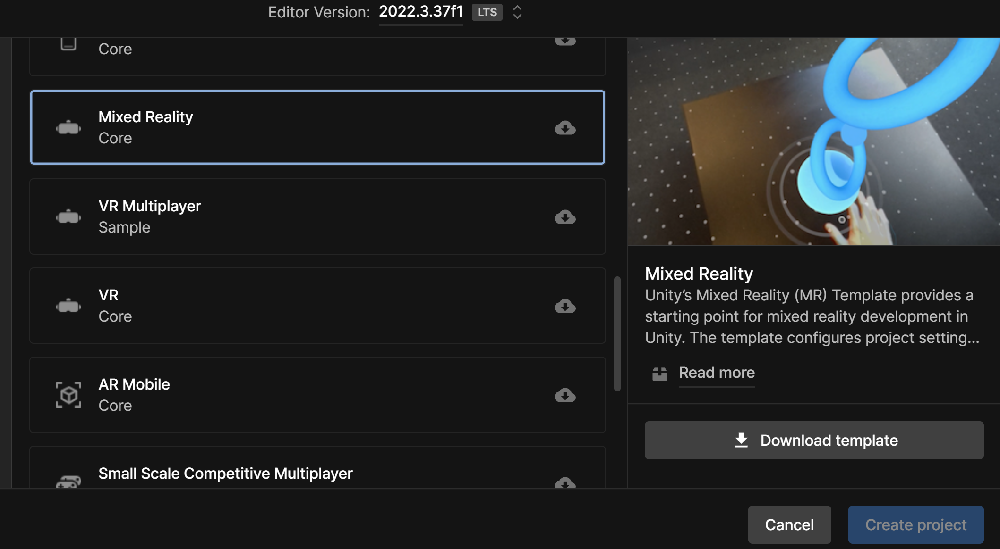
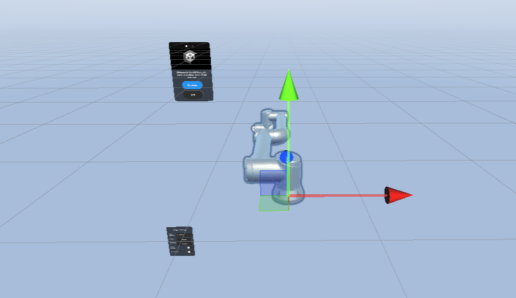
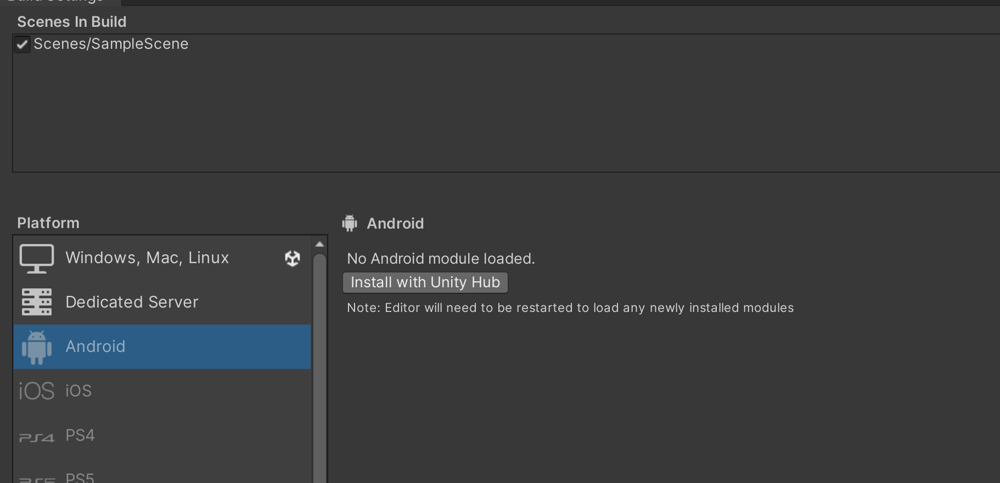
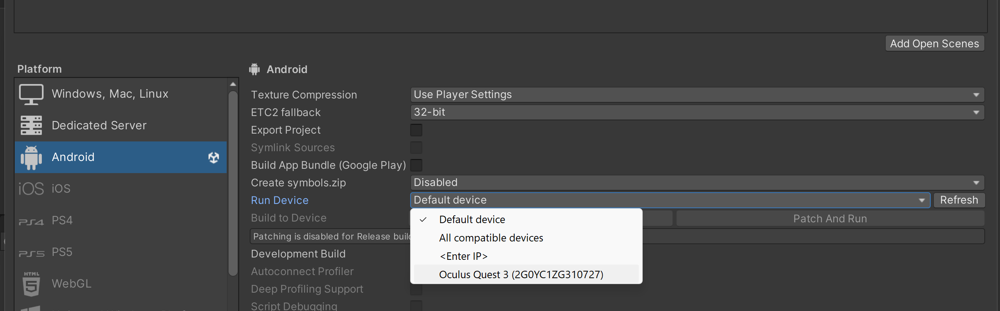

> For more extensive documentation, see [the wiki](https://github.com/parasollab/VR_Robot/wiki)!

# Project Setup Instructions

Clone the project and open it in Unity. All necessary packages should already be installed. The project was developed and tested for Unity Editor version 2022.3.37f1.

## Robot Setup Instructions

To import a new URDF robot into the scene, ensure the following folders are present:

- `Materials`
- `ur_description`
- `robot.urdf`

The `Materials`, `ur_description`, and `robot.urdf` files must be in the same folder.

By clicking on the `robot.urdf` file, then hovering over the **Assets** label on the top bar, and selecting **Import Robot from URDF**, a new URDF robot can be imported into the scene.

To allow the imported robot to be controlled in VR, the `Process URDF` script must be added to the scene, and its fields must be populated.

- Drag the URDF-imported robot from the scene into the `URDF Model` field.
- Drag the `Target Prefab` and the `Robot Options Prefab` from the `Assets/Prefabs` folder into the `URDF Parser` field as shown in the image above.
- Drag the `Affordance Theme` from the `Prefabs` folder into the appropriate field.
- Set the **Save as Prefab** checkbox to `true` to allow the robot to be saved as a Prefab in the `Prefabs` folder.

## ROS Connection Setup

See the Wiki

## Components Explanation

- **Target Prefab:** The white sphere seen on the robot's end effector, allowing for inverse kinematics control.
- **Robot Options Prefab:** The user menu enabling ROS joint recordings and control of specific joint angles via sliders.
- **Affordance Theme:** Highlights the joints being manipulated by the user and can be found in the `Prefabs` folder.
- **Ros:** Allows for joint trajectory message sending from the headset to the ROS node.

## AR Project Setup

To visualize the exported robot Prefab in an augmented reality scene, export the prefab as a Unity package, open the package in a mixed reality Unity project, and then drag the prefab into the AR scene.

### Exporting the Robot as a Unity Package

Right-click the prefab in the Assets explorer and then click **Export Package**.

### Create a Mixed Reality Project

Create a new mixed reality project using Unity's MR template.

Drag the imported robot prefab into the Sample Scene, which can be found at `Assets/Scenes`.

Install the ROS-TCP-Connector package following the instructions at [Unity-Technologies/ROS-TCP-Connector](https://github.com/Unity-Technologies/ROS-TCP-Connector).

To see the robot in passthrough mode, build and run the project in standalone mode.

To do so, on the top bar select **File -> Build Settings**.

Check if the Android Module is installed.

Install it if needed.

Click on **Switch Platform** to allow building to Android. Select the device you wish to build the application for in the **Run Device** field:

Finally, click on **Build and Run** the application.
